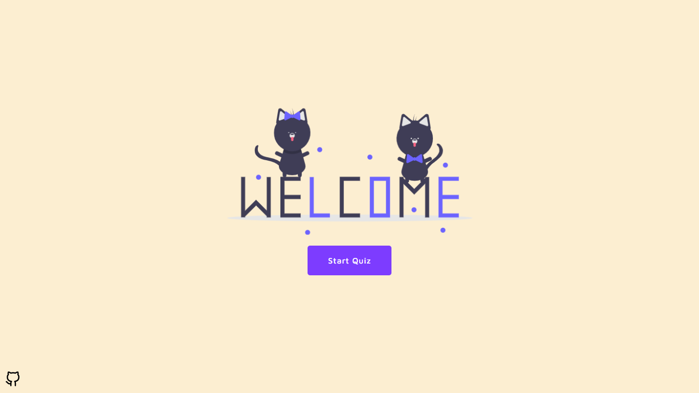
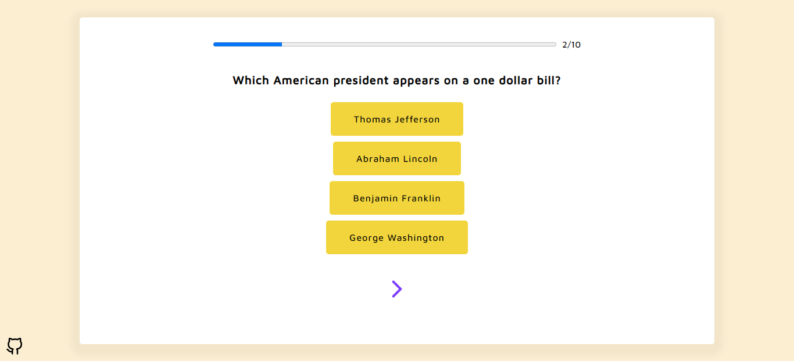
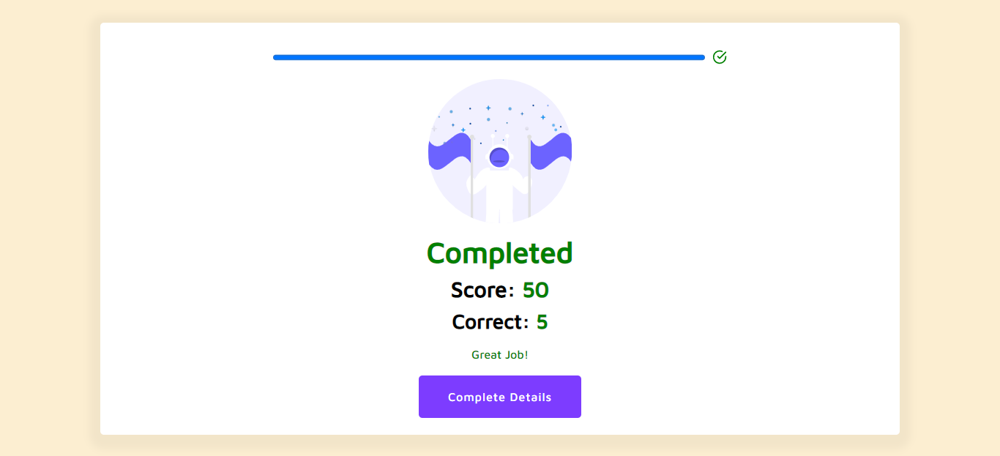
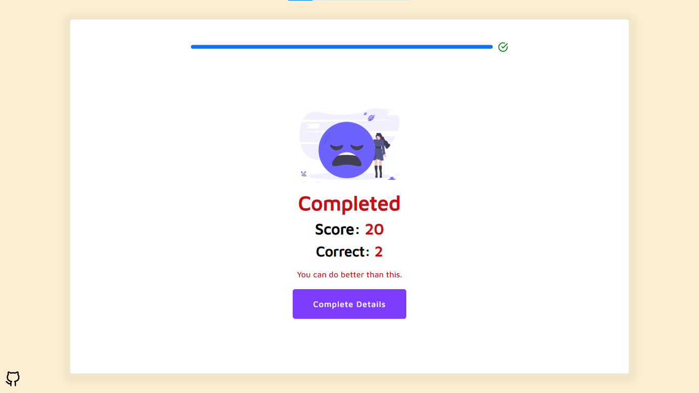
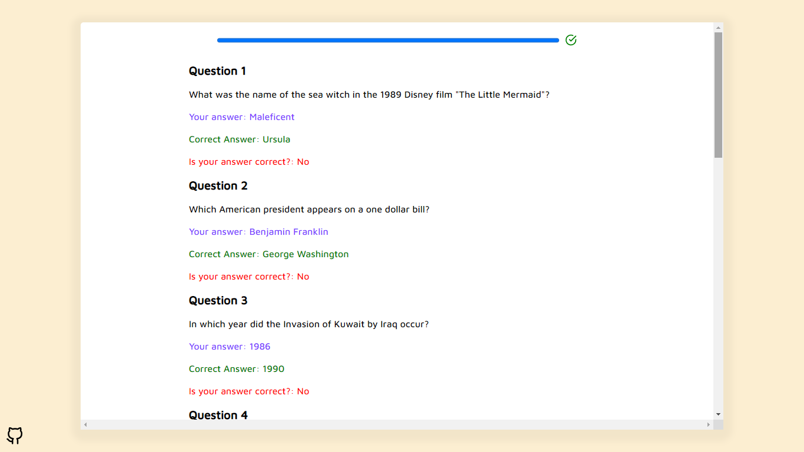

# Setup
##### To run this app locally,

```javascript
git clone 'https://github.com/7-baig/Quiz-PWA.git'
cd Quiz-PWA
npm install
npm start
```

##### This app will run on [http://localhost:3000](http://localhost:3000)


# Screenshots







